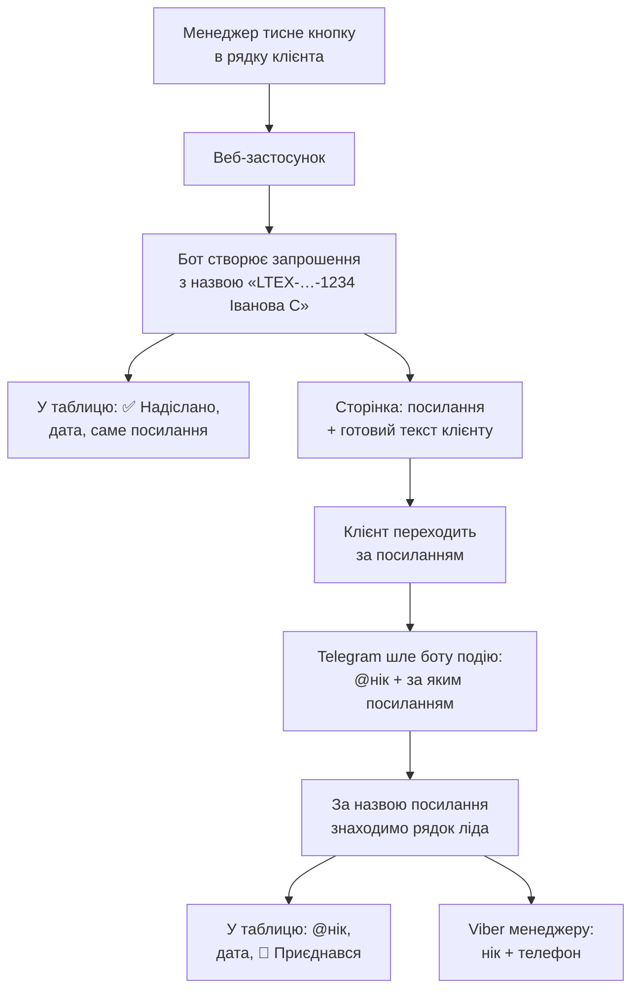
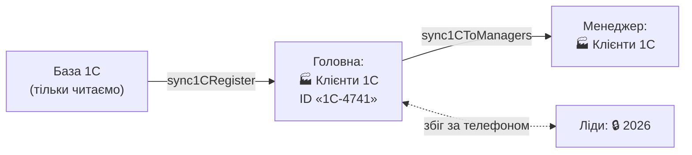

# 🔗 Telegram: статус надсилання, персональні посилання, нікнейми

Додає до **головної таблиці** та до таблиці **кожного менеджера**:

- статус «чи скинув менеджер клієнту посилання на наш Telegram-канал» —
  проставляється **автоматично**, без ручних відміток;
- **персональне посилання для кожного клієнта**;
- **нікнейм клієнта в Telegram**, який потрапляє в таблицю сам, щойно
  клієнт за цим посиланням перейшов — так нік звʼязується з номером телефону.

| Файл | Що всередині |
|---|---|
| [`TelegramLink.gs`](TelegramLink.gs) | колонки, кнопка, сторінка з посиланням, звіт |
| [`TelegramJoin.gs`](TelegramJoin.gs) | персональні посилання, приймання вступів, нікнейми |
| [`Telegram1C.gs`](Telegram1C.gs) | клієнти з бази 1С окремим листом + звірка двох баз |
| [`TelegramReport.gs`](TelegramReport.gs) | звіт у Viber: хто скільки надіслав і по яких областях |

У `Code.gs` треба додати **два рядки** (кроки 2 і 3).

---

## Як це працює

Статус ставиться не тоді, коли менеджер про це згадав, а тоді, коли він
**отримав посилання**: посилання видає лише сторінка, що відкривається з кнопки.
Нік прилітає не зі слів клієнта, а від самого Telegram.



Ключ до звʼязки — **назва запрошення**: `LTEX-20260909-1234 Іванова С`.
Вона починається з ID ліда, а в рядку ліда вже є телефон. Тому нік і номер
опиняються поруч без жодної ручної дії.

---

## Що зʼявиться в таблицях

**Головна таблиця** — колонки `T`–`Y` (додаються в кінець, наявні дані не зсуваються):

| Кол. | Заголовок | Що всередині |
|---|---|---|
| T | 📨 Надіслати TG | кнопка (текст із посиланням, не формула); напис змінюється на «🔁 Посилання», коли вже надіслано |
| U | Статус TG-посилання | `✅ Надіслано` · `👤 Приєднався` · `🚫 Не потрібно` · `❌ Відмовився` |
| V | Дата надсилання TG | `09.09.2026 14:35` |
| W | Видане TG-посилання | персональне посилання саме цього клієнта |
| X | TG нікнейм клієнта | `@ivan_petrov` — заповнюється сам у момент вступу |
| Y | Дата приєднання | коли клієнт зайшов у канал |

**Файл менеджера** — ті самі 6 колонок: `S`–`X`.

Колір статусу: 🟩 надіслано · 🟦 приєднався · 🟨 клієнт є, посилання ще не надсилали.
У примітці до ніку — Telegram id, імʼя в Telegram і назва посилання.
Колонка `O «Telegram»` заповнюється ніком теж, але лише якщо була порожня.

---

## Встановлення

### 1. Додати два файли
Apps Script → **＋ → Скрипт** → `TelegramLink`, потім так само `TelegramJoin`.

### 2–3. Два рядки в `Code.gs` (обовʼязково)

```js
function doGet(e) {
  if (e && e.parameter && e.parameter.a === "tg") return handleTgClick(e);   // ← кнопка
  if (e&&e.parameter&&e.parameter.action==="parse") return handleParseRequest(e.parameter);
  return ContentService.createTextOutput('{"status":"ok"}').setMimeType(ContentService.MimeType.JSON);
}

function doPost(e) {
  try {
    var data = e.postData ? JSON.parse(e.postData.contents) : (e.parameter||{});
    if (data && data.update_id) return handleTelegramUpdate(data, e);        // ← вступи в канал
    if (data.action==="parse") return handleParseRequest(data);
    // …решта без змін
```

### 4. Запустити `installTgColumns()`
Створює колонки в головній і в усіх файлах менеджерів, аркуш `🔗 TG-посилання`,
лог `_tg_log` і проставляє кнопки. Безпечно запускати повторно.

Робота йде кроками з бюджетом 4 хвилини (ліміт Apps Script — 6 хв). Якщо
таблиці великі й за один запуск не встигло, у журналі буде:

```
⏳ Не встигли за один запуск (ліміт Apps Script — 6 хв).
   Запустіть installTgColumns() ЩЕ РАЗ — продовжить з місця зупинки.
   Лишилось кроків: 4 із 14
```

Просто запускайте ще раз, поки не зʼявиться `🎉 Колонки й кнопки готові`.
Зроблені кроки не повторюються. `resetTgInstall()` скидає прогрес, якщо
треба переоформити все наново.

### 5. Бот — адміністратор каналу
1. [@BotFather](https://t.me/BotFather) → `/newbot` → скопіювати токен.
2. Канал → **Керування → Адміністратори → Додати** → ваш бот,
   права: **«Запрошувати користувачів»** (обовʼязково) і **«Додавати учасників»**.
3. Дізнатись `chat_id` каналу: переслати будь-який пост каналу боту
   [@getidsbot](https://t.me/getidsbot) — буде число виду `-1001234567890`.

### 6. Script Properties
Файл → **Властивості проєкту → Властивості скрипту**:

| Ключ | Значення |
|---|---|
| `TG_BOT_TOKEN` | токен з BotFather |
| `TG_CHAT_ID` | `-1001234567890` (або окремо по областях — колонка `C` аркуша посилань) |
| `TG_LINK_MODE` | `request` (типово) · `personal` · `off` |
| `TG_AUTO_APPROVE` | `ні`, якщо заявки треба схвалювати руками |

**`request`** — посилання багаторазове, клієнт тисне «Подати заявку», бот бачить, хто
подав, і одразу схвалює. Нік видно **завжди**. Рекомендовано.
**`personal`** — одноразове посилання, клієнт заходить одразу; якщо він
перешле посилання знайомому — його «зʼїсть» той, хто перейшов першим.
**`off`** — персональні вимкнено, працюють посилання по областях.

### 7. ⚠️ Оновити деплой — без цього нічого не запрацює
**Deploy → Manage deployments → ✏️ → Version: New version → Deploy.**
URL лишиться той самий (Viber-бот не зламається), але за ним почне
працювати новий код.

### 8. Вебхук Telegram і тригер
```
setTelegramWebhook()   // після оновлення деплою!
setupTgTrigger()       // кожні 15 хв: кнопки новим лідам + звірка статусів
```

### 9. Перевірка
```
testTgSetup()          // колонки, посилання, тригер
testTelegramBot()      // бот, права в каналі, вебхук, режим посилань
testTgPersonalLink()   // створює тестове запрошення і одразу відкликає
```
Далі — натисніть кнопку в будь-якому рядку і перейдіть за посиланням
зі свого Telegram: у колонці `X` має зʼявитися ваш нік.

### Запасний варіант без бота
Якщо `TG_BOT_TOKEN` не заданий, працюють посилання **по областях**:
впишіть їх у колонку `B` аркуша `🔗 TG-посилання` (рядок «За замовчуванням» —
для клієнтів без області). Нікнейми в цьому режимі не збираються —
Telegram показує лише, з якої області прийшов учасник.

---

## Клієнти з бази 1С

Окремий лист **«🏭 Клієнти 1С»** — у головній таблиці й у кожного менеджера,
з тими самими колонками, що й на робочому листі, і тією самою кнопкою.
Так персональне посилання можна надіслати не лише новому ліду, а й кожному,
хто вже є в 1С.



**Що переноситься.** Тільки потрібні колонки: ПІБ, телефон, місто, область,
категорія ТТ, канал пошуку, дата створення. Статуси 1С («Неактивний»,
«Потенційний», «Закрився») лягають у колонку «Цікавить» рядком
`1С: Неактивний · Оп: Неактивний`, щоб менеджер бачив, з ким має справу,
і при цьому набір колонок лишався такий самий, як на робочому листі.

**Рядки без нормального телефону пропускаються** — папки 1С, «1111111111»,
іноземні номери. Іноземний краще пропустити, ніж перетворити на схожий
український і написати чужій людині.

**Збіги між базами.** Той самий клієнт часто є і лідом, і карткою в 1С.
Звіряємо за телефоном і звʼязуємо рядки: у ліда в колонці «⚠️ Дублі
телефону» зʼявляється `1С: 4741`, у рядка 1С — `Лід: LTEX-…`. Далі це
одна людина:

- посилання видається **одне на двох** — з якого рядка не натисни;
- статус, дата й нікнейм проставляються **в обох рядках одразу**;
- скасування статусу теж знімає його в обох.

**Агенти 1С → менеджери.** У 1С імʼя торгового агента буває записане інакше
(«Володимир» замість «Мельник Володимир»). Лист **«🏭 Агенти 1С»** тримає цю
відповідність: заповнюється здогадкою, а ви можете виправити будь-який рядок
вручну. Якщо навпроти агента порожньо — його клієнти нікуди не поїдуть,
`test1CSetup()` про це попередить.

### Запуск

```
install1CTelegram()   // усе разом, кроками; повторюйте, поки не буде 🎉
test1CSetup()         // що перенеслось, чи всі агенти звʼязані
setup1CTrigger()      // щоденне оновлення з 1С о 6:00
```

Клієнти переносяться партіями (`TG1C_BATCH`, типово 4000 рядків за запуск),
тож на великій базі знадобиться кілька запусків. Поки перенесено не все,
у журналі буде `ЩЕ ЛИШИЛОСЬ: N` і `⏳ Ще не все` — крок навмисно не
позначається виконаним, інакше залишок ніколи б не доїхав. Розкладання по
менеджерах починається лише після того, як усі клієнти вже в головній.

Потрібен Script Property **`ONS_FILE_ID`** — ID таблиці «L-TEX | База 1С»
(він уже заданий, якщо працює команда `/1с` у боті).

| Функція | Що робить |
|---|---|
| `install1CTelegram()` | створити листи й розкласти клієнтів (кроками) |
| `sync1CRegister()` | підтягнути нових клієнтів із 1С у головну |
| `sync1CToManagers()` | рознести їх по менеджерах |
| `tg1CRefreshButtons()` | кнопки новим рядкам 1С |
| `test1CSetup()` · `reset1CInstall()` | перевірка · скинути прогрес установки |

Якщо установка колись зупинилась на півдорозі і `install1CTelegram()`
відмовляється довантажувати решту — `reset1CInstall()`, далі
`install1CTelegram()` заново. Дублів не буде: рядки звіряються за кодом 1С.

У базу 1С **нічого не пишеться** — вона лише джерело. Колонки, які веде
менеджер (перший контакт, активність, статус дії, оновлений статус,
коментар), і весь TG-блок при оновленні не затираються.

---

## Звіт про роботу

Цифри беруться не зі статусів у таблиці, а з логу `_tg_log`, де кожне
надсилання й кожне приєднання записане з датою, областю і менеджером.
Тому «за вчора» — це справді за вчора, а не «дата останнього надсилання».

```
📊 РОЗСИЛКА TELEGRAM — вчора (09.09.2026)

📨 Надіслано вперше: 143
   ліди 38 · база 1С 105
🔁 Повторних відкриттів: 12
👤 Приєднались до каналу: 21
   конверсія: 15%

👤 МЕНЕДЖЕРИ (надіслано / приєднались)
  Дунас Богдан — 42 / 7
  Захарчук Олександра — 38 / 5

🗺 ОБЛАСТІ (надіслано / приєднались)
  Волинська — 22 / 3
  Львівська — 18 / 4

📈 ПОКРИТТЯ БАЗИ (усього надіслано)
  Ліди: 620 з 1546 (40%)
  База 1С: 500 з 4837 (10%)

Залишилось надіслати:
  Захарчук Олександра — 980
```

**Команда в боті** (потрібен патч Б нижче):

| Команда | Період |
|---|---|
| `/звіт` | сьогодні |
| `/звіт вчора` · `/звіт тиждень` · `/звіт місяць` · `/звіт все` | відповідно |
| `/звіт детально` | додає розріз «менеджер × область» |

**Щодня о 9:00** — `setupTgReportTrigger()`, звіт за вчора власникам
(`NOTIFY_IDS`). Щоб кожен менеджер отримував ще й свої особисті цифри,
задайте Script Property `TG_REPORT_TO_MANAGERS` = `так`.

`testTgReport()` — надрукувати звіт за весь час у журнал, нічого не надсилаючи.

---

## Необовʼязкові патчі `Code.gs`

**А. Кнопка новому ліду одразу** — у `onEdit(e)`, після `syncToManager(...)`:
```js
if (typeof tgFillButtons_ === "function" && !sheet.getRange(row, TG_MAIN_BTN).getFormula()) {
  tgFillButtons_(sheet, row, [[rowId]], TG_MAIN_BTN, TG_MAIN_STATUS, true);
}
```

**Б. Команди бота** — у `doPost`, поруч з іншими командами:
```js
if (tl.startsWith("/тг")||tl.startsWith("/tg"))     { handleTgCommand(text, sender);     return okResponse(); }
if (tl.startsWith("/нік")||tl.startsWith("/nick"))  { handleNickCommand(text, sender);   return okResponse(); }
if (tl.startsWith("/звіт")||tl.startsWith("/звит")) { handleReportCommand(text, sender); return okResponse(); }
```
- `/тг 0671234567` — посилання клієнта + готовий текст, статус ставиться сам;
- `/нік @ivan_petrov` — чий це нік: ПІБ, телефон, менеджер;
- `/нік 0671234567` — який нік у цього клієнта.

Додайте і в `/допомога`:
```js
"/тг 0671234567 — посилання на канал + статус\n"+
"/нік @ivan — чий це нікнейм\n"+
"/звіт — хто скільки надіслав\n"+
```

**В. Блок у щоденному звіті** — у `sendDailyReport()`, перед `notifyOwners(report)`:
```js
report += getTgStatsBlock_();
```
```
🔗 Посилання на Telegram-канал: 120 з 350 (34%)
  Надіслано вчора: 12
  Приєдналось: 41
  Залишилось надіслати:
   - Максимюк Анна: 58 (надіслано 22)
```
Без патча той самий звіт шле окрема функція `sendTgReport()`.

**Г. Статуси через `/довідник`** — у `handleDictionaryCommand`, у `typeMap`:
```js
"тг":"G","телеграм":"G","tg посилання":"G",
```

---

## ⚠️ Одна важлива обережність

Стара функція **`fixManagerColumns()`** перебудовує файли менеджерів під
18 колонок і **зітре колонки TG**. Якщо вона ще потрібна — додайте
6 заголовків у її масив `correctHeaders`:

```js
var correctHeaders=[..., HDR_NEW_STATUS, HDR_NEW_COMMENT,
                    TG_HDR_BTN, TG_HDR_STATUS, TG_HDR_DATE,
                    TG_HDR_LINK, TG_HDR_NICK, TG_HDR_JOINED];
```
і після неї запустіть `refreshTgButtonsForce()`.

Якщо статуси все ж затерли — `restoreTgStatusesFromLog()` відновить їх із логу
`_tg_log`. Те саме після додавання нового менеджера: просто запустіть
`installTgColumns()` ще раз.

---

## Функції

| Функція | Що робить |
|---|---|
| `installTgColumns()` | встановлення / оновлення після нового менеджера (кроками, продовжується) |
| `resetTgInstall()` | скинути прогрес установки |
| `refreshTgButtons()` | доставити кнопки новим рядкам + звірити статуси |
| `refreshTgButtonsForce()` | перезаписати **всі** кнопки (після зміни URL деплою) |
| `setupTgTrigger()` / `removeTgTrigger()` | автозапуск кожні 15 хв |
| `setTelegramWebhook()` | увімкнути приймання вступів у канал |
| `deleteTelegramWebhook()` / `getTelegramWebhookInfo()` | зняти / подивитись стан вебхука |
| `findLeadByTgNick("@ivan")` | нік → клієнт і телефон (і навпаки) |
| `testTgSetup()` · `testTelegramBot()` · `testTgPersonalLink()` | діагностика |
| `sendTgReport()` | звіт у Viber власникам |
| `restoreTgStatusesFromLog()` | відновити статуси з логу |

---

## Питання, які виникають

**Нік не зʼявився після переходу.** Перевірте `testTelegramBot()`: бот має бути
адміністратором каналу з правом «Запрошувати користувачів», вебхук —
встановлений **після** оновлення деплою. У режимі `personal` Telegram шле
подію `chat_member`, і вона працює тільки якщо вебхук ставився цим скриптом
(`setTelegramWebhook()` вмикає її явно).

**У клієнта немає ніку.** У колонку `X` піде `Іван Петров (id 123456789)` —
цього достатньо, щоб знайти людину в списку учасників каналу.

**Клієнт уже отримав посилання області, а тепер увімкнули бота.**
Рядок збереже те посилання, яке клієнт справді отримав — нове не видається.
Персональні посилання підуть на всі **нові** надсилання.

**Чому сторінка відкривається швидше.** З критичного шляху прибрано все, що
можна:

- у головну таблицю статус пишеться до показу, а запис у **окремий файл
  менеджера**, примітку і дзеркалення на другий рядок клієнта сторінка
  замовляє сама, вже показавшись (`tgFinishClick`). Якщо вкладку закрити
  миттєво, це донесе плановий `tgRefreshJob` протягом 15 хвилин;
- **номер рядка зашитий у саму кнопку** (`&r=804`), тож замість читання всієї
  колонки ID (на листі 1С це майже 5000 рядків) перевіряється одна клітинка.
  Підказка саме перевіряється: якщо рядок зсунувся, код чесно шукає, а тригер
  оновить кнопку;
- **знято блокування скрипта** — воно ставило в чергу кліки всіх менеджерів,
  та ще й чекало всередині відповіді Telegram. Різні рядки одне одному не
  заважають;
- властивості скрипта читаються **одним запитом**, а не пʼятьма;
- відкриті таблиці й список менеджерів кешуються на час запуску.

Лишається те, на що вплинути не можна: холодний старт веб-застосунку
Apps Script (1–2 с) і, при першому надсиланні, створення персонального
запрошення через Telegram (0,3–0,8 с).

Після оновлення варто один раз запустити `refreshTgButtonsForce()` —
кнопки перезапишуться з номером рядка. Інакше їх поступово оновить
плановий тригер.

**Кнопка відкриває діалог саме з цим клієнтом.** Підставити текст у чужий
чат уміє тільки WhatsApp — його посилання несе і номер, і повідомлення.
Viber і Telegram такого не дозволяють, тому при натисканні текст лягає
в буфер обміну, а в чаті лишається натиснути «Вставити». Якщо діалог
не відкривається, під кнопками є запасний варіант «через список чатів».

**«Номера немає в месенджері».** Перевірити це з веб-сторінки неможливо —
відповідає лише сам месенджер, коли ви спробуєте відкрити чат. Тому під
кнопками є позначки «немає в Viber / Telegram / WhatsApp»: натиснули один
раз — і це записалось у колонку коментаря та зʼявиться попередженням
угорі сторінки наступного разу.

**Текст повідомлення** береться з `TG_MSG_DEFAULT`, або зі Script Property
`TG_MSG_TEMPLATE`, якщо вона задана. Плейсхолдери `{manager}`, `{link}`,
`{name}` — у імені менеджера підставляється лише імʼя без прізвища
(«Кузенко Тарас» → «Тарас»).

**Хтось випадково натиснув кнопку.** Внизу сторінки — «Скасувати статус».
Нік і дату приєднання скасування не чіпає: клієнт справді в каналі.

**Клієнт вийшов із каналу.** Нік лишається в таблиці; статус автоматично
не змінюється (подія виходу навмисно ігнорується, щоб не терти дані).

**Чи може хтось підробити подію вступу?** Ні. Вебхук приймає лише запити
з підписом `?tghook=…`, звіреним із `TG_HOOK_SECRET` у Script Properties;
повтори того самого `update_id` відкидаються.

**`Exceeded maximum execution time` під час установки.** Це нормально для
великих таблиць: Apps Script обриває будь-яку функцію на 6-й хвилині. Прогрес
збережено — просто запустіть `installTgColumns()` ще раз (і ще, якщо треба),
поки не побачите `🎉`.

**Кнопка відкриває `{"status":"ok"}`.** Не оновлено деплой — крок 7.

**У колонці кнопок `#ERROR!`.** Так було в ранній версії: кнопка робилась
формулою `=HYPERLINK(...)` з комами, а в українській локалі Google Sheets
роздільник аргументів — `;`. Тепер кнопка — це текст із посиланням, який не
залежить від мови таблиці. Оновіть `TelegramLink.gs` і запустіть
`refreshTgButtonsForce()` — усі зламані клітинки перезапишуться.

**Кнопка веде на старий деплой.** Константа `WEBHOOK_URL` у `Code.gs` прописана
руками й могла застаріти. `testTgSetup()` звертається за адресою кнопок і каже,
який код там відповідає: `❌ Деплой: за адресою кнопок ще СТАРИЙ код` означає, що
бракує рядка `handleTgClick` у `doGet` або не оновлено деплой. Якщо URL справді
інший — додайте Script Property `TG_TRACK_URL` із правильною адресою
(Розгорнути → Керувати розгортаннями → URL веб-додатка) і запустіть
`refreshTgButtonsForce()`.

**Кнопка каже «Посилання застаріле».** Змінився `TG_SECRET` або URL деплою —
запустіть `refreshTgButtonsForce()`.
