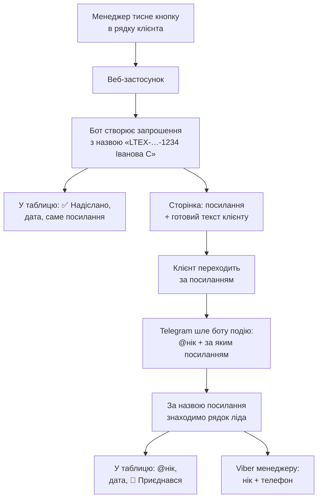

# 🔗 Telegram: статус надсилання, персональні посилання, нікнейми

Додає до **головної таблиці** та до таблиці **кожного менеджера**:

- статус «чи скинув менеджер клієнту посилання на наш Telegram-канал» —
  проставляється **автоматично**, без ручних відміток;
- **персональне посилання для кожного клієнта**;
- **нікнейм клієнта в Telegram**, який потрапляє в таблицю сам, щойно
  клієнт за цим посиланням перейшов — так нік звʼязується з номером телефону.

| Файл | Що всередині |
|---|---|
| [`TelegramLink.gs`](TelegramLink.gs) | колонки, кнопка, сторінка з посиланням, звіт |
| [`TelegramJoin.gs`](TelegramJoin.gs) | персональні посилання, приймання вступів, нікнейми |

У `Code.gs` треба додати **два рядки** (кроки 2 і 3).

---

## Як це працює

Статус ставиться не тоді, коли менеджер про це згадав, а тоді, коли він
**отримав посилання**: посилання видає лише сторінка, що відкривається з кнопки.
Нік прилітає не зі слів клієнта, а від самого Telegram.



Ключ до звʼязки — **назва запрошення**: `LTEX-20260909-1234 Іванова С`.
Вона починається з ID ліда, а в рядку ліда вже є телефон. Тому нік і номер
опиняються поруч без жодної ручної дії.

---

## Що зʼявиться в таблицях

**Головна таблиця** — колонки `T`–`Y` (додаються в кінець, наявні дані не зсуваються):

| Кол. | Заголовок | Що всередині |
|---|---|---|
| T | 📨 Надіслати TG | кнопка; напис змінюється на «🔁 Посилання», коли вже надіслано |
| U | Статус TG-посилання | `✅ Надіслано` · `👤 Приєднався` · `🚫 Не потрібно` · `❌ Відмовився` |
| V | Дата надсилання TG | `09.09.2026 14:35` |
| W | Видане TG-посилання | персональне посилання саме цього клієнта |
| X | TG нікнейм клієнта | `@ivan_petrov` — заповнюється сам у момент вступу |
| Y | Дата приєднання | коли клієнт зайшов у канал |

**Файл менеджера** — ті самі 6 колонок: `S`–`X`.

Колір статусу: 🟩 надіслано · 🟦 приєднався · 🟨 клієнт є, посилання ще не надсилали.
У примітці до ніку — Telegram id, імʼя в Telegram і назва посилання.
Колонка `O «Telegram»` заповнюється ніком теж, але лише якщо була порожня.

---

## Встановлення

### 1. Додати два файли
Apps Script → **＋ → Скрипт** → `TelegramLink`, потім так само `TelegramJoin`.

### 2–3. Два рядки в `Code.gs` (обовʼязково)

```js
function doGet(e) {
  if (e && e.parameter && e.parameter.a === "tg") return handleTgClick(e);   // ← кнопка
  if (e&&e.parameter&&e.parameter.action==="parse") return handleParseRequest(e.parameter);
  return ContentService.createTextOutput('{"status":"ok"}').setMimeType(ContentService.MimeType.JSON);
}

function doPost(e) {
  try {
    var data = e.postData ? JSON.parse(e.postData.contents) : (e.parameter||{});
    if (data && data.update_id) return handleTelegramUpdate(data, e);        // ← вступи в канал
    if (data.action==="parse") return handleParseRequest(data);
    // …решта без змін
```

### 4. Запустити `installTgColumns()`
Створює колонки в головній і в усіх файлах менеджерів, аркуш `🔗 TG-посилання`,
лог `_tg_log` і проставляє кнопки. Безпечно запускати повторно.

Робота йде кроками з бюджетом 4 хвилини (ліміт Apps Script — 6 хв). Якщо
таблиці великі й за один запуск не встигло, у журналі буде:

```
⏳ Не встигли за один запуск (ліміт Apps Script — 6 хв).
   Запустіть installTgColumns() ЩЕ РАЗ — продовжить з місця зупинки.
   Лишилось кроків: 4 із 14
```

Просто запускайте ще раз, поки не зʼявиться `🎉 Колонки й кнопки готові`.
Зроблені кроки не повторюються. `resetTgInstall()` скидає прогрес, якщо
треба переоформити все наново.

### 5. Бот — адміністратор каналу
1. [@BotFather](https://t.me/BotFather) → `/newbot` → скопіювати токен.
2. Канал → **Керування → Адміністратори → Додати** → ваш бот,
   права: **«Запрошувати користувачів»** (обовʼязково) і **«Додавати учасників»**.
3. Дізнатись `chat_id` каналу: переслати будь-який пост каналу боту
   [@getidsbot](https://t.me/getidsbot) — буде число виду `-1001234567890`.

### 6. Script Properties
Файл → **Властивості проєкту → Властивості скрипту**:

| Ключ | Значення |
|---|---|
| `TG_BOT_TOKEN` | токен з BotFather |
| `TG_CHAT_ID` | `-1001234567890` (або окремо по областях — колонка `C` аркуша посилань) |
| `TG_LINK_MODE` | `request` (типово) · `personal` · `off` |
| `TG_AUTO_APPROVE` | `ні`, якщо заявки треба схвалювати руками |

**`request`** — посилання багаторазове, клієнт тисне «Подати заявку», бот бачить, хто
подав, і одразу схвалює. Нік видно **завжди**. Рекомендовано.
**`personal`** — одноразове посилання, клієнт заходить одразу; якщо він
перешле посилання знайомому — його «зʼїсть» той, хто перейшов першим.
**`off`** — персональні вимкнено, працюють посилання по областях.

### 7. ⚠️ Оновити деплой — без цього нічого не запрацює
**Deploy → Manage deployments → ✏️ → Version: New version → Deploy.**
URL лишиться той самий (Viber-бот не зламається), але за ним почне
працювати новий код.

### 8. Вебхук Telegram і тригер
```
setTelegramWebhook()   // після оновлення деплою!
setupTgTrigger()       // кожні 15 хв: кнопки новим лідам + звірка статусів
```

### 9. Перевірка
```
testTgSetup()          // колонки, посилання, тригер
testTelegramBot()      // бот, права в каналі, вебхук, режим посилань
testTgPersonalLink()   // створює тестове запрошення і одразу відкликає
```
Далі — натисніть кнопку в будь-якому рядку і перейдіть за посиланням
зі свого Telegram: у колонці `X` має зʼявитися ваш нік.

### Запасний варіант без бота
Якщо `TG_BOT_TOKEN` не заданий, працюють посилання **по областях**:
впишіть їх у колонку `B` аркуша `🔗 TG-посилання` (рядок «За замовчуванням» —
для клієнтів без області). Нікнейми в цьому режимі не збираються —
Telegram показує лише, з якої області прийшов учасник.

---

## Необовʼязкові патчі `Code.gs`

**А. Кнопка новому ліду одразу** — у `onEdit(e)`, після `syncToManager(...)`:
```js
if (typeof tgFillButtons_ === "function" && !sheet.getRange(row, TG_MAIN_BTN).getFormula()) {
  tgFillButtons_(sheet, row, [[rowId]], TG_MAIN_BTN, TG_MAIN_STATUS, true);
}
```

**Б. Команди бота** — у `doPost`, поруч з іншими командами:
```js
if (tl.startsWith("/тг")||tl.startsWith("/tg"))     { handleTgCommand(text, sender);   return okResponse(); }
if (tl.startsWith("/нік")||tl.startsWith("/nick"))  { handleNickCommand(text, sender); return okResponse(); }
```
- `/тг 0671234567` — посилання клієнта + готовий текст, статус ставиться сам;
- `/нік @ivan_petrov` — чий це нік: ПІБ, телефон, менеджер;
- `/нік 0671234567` — який нік у цього клієнта.

Додайте і в `/допомога`:
```js
"/тг 0671234567 — посилання на канал + статус\n"+
"/нік @ivan — чий це нікнейм\n"+
```

**В. Блок у щоденному звіті** — у `sendDailyReport()`, перед `notifyOwners(report)`:
```js
report += getTgStatsBlock_();
```
```
🔗 Посилання на Telegram-канал: 120 з 350 (34%)
  Надіслано вчора: 12
  Приєдналось: 41
  Залишилось надіслати:
   - Максимюк Анна: 58 (надіслано 22)
```
Без патча той самий звіт шле окрема функція `sendTgReport()`.

**Г. Статуси через `/довідник`** — у `handleDictionaryCommand`, у `typeMap`:
```js
"тг":"G","телеграм":"G","tg посилання":"G",
```

---

## ⚠️ Одна важлива обережність

Стара функція **`fixManagerColumns()`** перебудовує файли менеджерів під
18 колонок і **зітре колонки TG**. Якщо вона ще потрібна — додайте
6 заголовків у її масив `correctHeaders`:

```js
var correctHeaders=[..., HDR_NEW_STATUS, HDR_NEW_COMMENT,
                    TG_HDR_BTN, TG_HDR_STATUS, TG_HDR_DATE,
                    TG_HDR_LINK, TG_HDR_NICK, TG_HDR_JOINED];
```
і після неї запустіть `refreshTgButtonsForce()`.

Якщо статуси все ж затерли — `restoreTgStatusesFromLog()` відновить їх із логу
`_tg_log`. Те саме після додавання нового менеджера: просто запустіть
`installTgColumns()` ще раз.

---

## Функції

| Функція | Що робить |
|---|---|
| `installTgColumns()` | встановлення / оновлення після нового менеджера (кроками, продовжується) |
| `resetTgInstall()` | скинути прогрес установки |
| `refreshTgButtons()` | доставити кнопки новим рядкам + звірити статуси |
| `refreshTgButtonsForce()` | перезаписати **всі** кнопки (після зміни URL деплою) |
| `setupTgTrigger()` / `removeTgTrigger()` | автозапуск кожні 15 хв |
| `setTelegramWebhook()` | увімкнути приймання вступів у канал |
| `deleteTelegramWebhook()` / `getTelegramWebhookInfo()` | зняти / подивитись стан вебхука |
| `findLeadByTgNick("@ivan")` | нік → клієнт і телефон (і навпаки) |
| `testTgSetup()` · `testTelegramBot()` · `testTgPersonalLink()` | діагностика |
| `sendTgReport()` | звіт у Viber власникам |
| `restoreTgStatusesFromLog()` | відновити статуси з логу |

---

## Питання, які виникають

**Нік не зʼявився після переходу.** Перевірте `testTelegramBot()`: бот має бути
адміністратором каналу з правом «Запрошувати користувачів», вебхук —
встановлений **після** оновлення деплою. У режимі `personal` Telegram шле
подію `chat_member`, і вона працює тільки якщо вебхук ставився цим скриптом
(`setTelegramWebhook()` вмикає її явно).

**У клієнта немає ніку.** У колонку `X` піде `Іван Петров (id 123456789)` —
цього достатньо, щоб знайти людину в списку учасників каналу.

**Клієнт уже отримав посилання області, а тепер увімкнули бота.**
Рядок збереже те посилання, яке клієнт справді отримав — нове не видається.
Персональні посилання підуть на всі **нові** надсилання.

**Хтось випадково натиснув кнопку.** Внизу сторінки — «Скасувати статус».
Нік і дату приєднання скасування не чіпає: клієнт справді в каналі.

**Клієнт вийшов із каналу.** Нік лишається в таблиці; статус автоматично
не змінюється (подія виходу навмисно ігнорується, щоб не терти дані).

**Чи може хтось підробити подію вступу?** Ні. Вебхук приймає лише запити
з підписом `?tghook=…`, звіреним із `TG_HOOK_SECRET` у Script Properties;
повтори того самого `update_id` відкидаються.

**`Exceeded maximum execution time` під час установки.** Це нормально для
великих таблиць: Apps Script обриває будь-яку функцію на 6-й хвилині. Прогрес
збережено — просто запустіть `installTgColumns()` ще раз (і ще, якщо треба),
поки не побачите `🎉`.

**Кнопка відкриває `{"status":"ok"}`.** Не оновлено деплой — крок 7.

**Кнопка веде на старий деплой.** Константа `WEBHOOK_URL` у `Code.gs` прописана
руками й могла застаріти. `testTgSetup()` сам порівняє її з поточним URL і скаже,
якщо вони різні: тоді додайте Script Property `TG_TRACK_URL` з правильним URL
(Deploy → Manage deployments → Web app URL) і запустіть `refreshTgButtonsForce()`.

**Кнопка каже «Посилання застаріле».** Змінився `TG_SECRET` або URL деплою —
запустіть `refreshTgButtonsForce()`.
