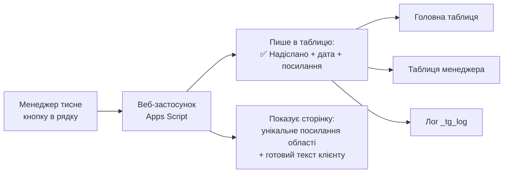

# 🔗 Статус «посилання на Telegram надіслано» + кнопка

Додає до **головної таблиці** та до таблиці **кожного менеджера** статус
«чи скинув менеджер клієнту посилання на наш Telegram-канал» — і кнопку,
яка проставляє цей статус **автоматично**, без ручних відміток.

Файл: [`TelegramLink.gs`](TelegramLink.gs) — окремий файл проєкту Apps Script.
У `Code.gs` треба додати **один рядок** (крок 2).

---

## Чому людський фактор виключено

Статус ставиться не тоді, коли менеджер про це згадав, а тоді, коли він
**отримав посилання**. Унікальні посилання по областях ніде більше не лежать —
їх видає лише сторінка, яка відкривається з кнопки. Отримати посилання й не
залишити сліду неможливо.



---

## Що зʼявиться в таблицях

**Головна таблиця** — колонки `T`, `U`, `V`, `W` (додаються в кінець, наявні дані не зсуваються):

| Колонка | Заголовок | Що всередині |
|---|---|---|
| T | 📨 Надіслати TG | кнопка (формула `HYPERLINK`); напис змінюється на «🔁 Посилання», коли вже надіслано |
| U | Статус TG-посилання | `✅ Надіслано` · `👤 Приєднався` · `🚫 Не потрібно` · `❌ Відмовився` |
| V | Дата надсилання TG | `09.09.2026 14:35` |
| W | Видане TG-посилання | те саме посилання, яке отримав клієнт |

**Файл менеджера** — ті самі 4 колонки: `S`, `T`, `U`, `V`.

Колір статусу: 🟩 надіслано · 🟦 приєднався · 🟨 клієнт є, посилання ще не надсилали.
У примітці до комірки статусу видно, хто і звідки надіслав.

---

## Встановлення (≈10 хвилин)

### 1. Додати файл
Apps Script → **＋ → Скрипт** → назвати `TelegramLink` → вставити вміст
[`TelegramLink.gs`](TelegramLink.gs) → зберегти.

### 2. Один рядок у `Code.gs` (обовʼязково)

```js
function doGet(e) {
  if (e && e.parameter && e.parameter.a === "tg") return handleTgClick(e);   // ← додати
  if (e&&e.parameter&&e.parameter.action==="parse") return handleParseRequest(e.parameter);
  return ContentService.createTextOutput('{"status":"ok"}').setMimeType(ContentService.MimeType.JSON);
}
```

### 3. Запустити `installTgColumns()`
Створює колонки в головній і в усіх файлах менеджерів, аркуш `🔗 TG-посилання`,
лог `_tg_log` і проставляє кнопки. Безпечно запускати повторно.

### 4. Вписати посилання
Аркуш **`🔗 TG-посилання`** головної таблиці — колонка `B` навпроти кожної області.
Рядок **«За замовчуванням»** — для клієнтів без області.
Колонки `D`/`E` рахуються самі: скільки разів надіслано і коли востаннє.

### 5. ⚠️ Оновити деплой — без цього кнопка не працюватиме
**Deploy → Manage deployments → ✏️ → Version: New version → Deploy.**
URL залишиться той самий (Viber-бот не зламається), але за ним почне
працювати новий код.

### 6. Тригер і перевірка
```
setupTgTrigger()   // кожні 15 хв: кнопки новим лідам + звірка статусів
testTgSetup()      // діагностика: колонки, посилання, тригер
```
Далі — натисніть кнопку в будь-якому рядку. Статус має зʼявитися одразу.

---

## Необовʼязкові патчі `Code.gs`

Без них усе працює; тригер із кроку 6 усе одно все підхопить за 15 хвилин.

**А. Кнопка новому ліду одразу** — у `onEdit(e)`, після `syncToManager(...)`:
```js
if (typeof tgFillButtons_ === "function" && !sheet.getRange(row, TG_MAIN_BTN).getFormula()) {
  tgFillButtons_(sheet, row, [[rowId]], TG_MAIN_BTN, TG_MAIN_STATUS, true);
}
```

**Б. Команда бота `/тг 0671234567`** — у `doPost`, поруч з іншими командами:
```js
if (tl.startsWith("/тг")||tl.startsWith("/tg")) { handleTgCommand(text, sender); return okResponse(); }
```
Менеджер пише боту номер — бот віддає посилання його області, готовий текст
і сам ставить статус. Зручно з телефона. Додайте рядок і в `/допомога`:
```js
"/тг 0671234567 — посилання на Telegram-канал + статус\n"+
```

**В. Блок у щоденному звіті** — у `sendDailyReport()`, перед `notifyOwners(report)`:
```js
report += getTgStatsBlock_();
```
```
🔗 Посилання на Telegram-канал: 120 з 350 (34%)
  Надіслано вчора: 12
  Приєдналось: 41
  Залишилось надіслати:
   - Максимюк Анна: 58 (надіслано 22)
```
Без патча той самий звіт можна слати окремо функцією `sendTgReport()`.

**Г. Статуси через `/довідник`** — у `handleDictionaryCommand`, у `typeMap`:
```js
"тг":"G","телеграм":"G","tg посилання":"G",
```

---

## ⚠️ Одна важлива обережність

Стара функція **`fixManagerColumns()`** перебудовує файли менеджерів під
18 колонок і **зітре колонки TG**. Якщо вона вам ще потрібна — додайте
4 заголовки в її масив `correctHeaders`:

```js
var correctHeaders=[..., HDR_NEW_STATUS, HDR_NEW_COMMENT,
                    TG_HDR_BTN, TG_HDR_STATUS, TG_HDR_DATE, TG_HDR_LINK];
```
і після неї запустіть `refreshTgButtonsForce()`.

Якщо статуси все ж затерли — `restoreTgStatusesFromLog()` відновить їх із логу
`_tg_log`. Те саме стосується `setupManagerFile()`: після додавання нового
менеджера просто запустіть `installTgColumns()` ще раз.

---

## Персональні посилання (опційно, точний облік «хто приєднався»)

Посилання по областях показують, **з якої області** прийшов учасник.
Якщо треба знати поіменно — увімкніть персональні одноразові посилання:
Telegram сам покаже, хто прийшов за кожним із них.

Script Properties:

| Ключ | Значення |
|---|---|
| `TG_BOT_TOKEN` | токен бота — адміністратора каналу |
| `TG_LINK_MODE` | `personal` — одноразове посилання, або `request` — заявка на вступ |
| `TG_CHAT_ID` | ID каналу (або в колонці `C` аркуша посилань — окремо для кожної області) |

Кожному клієнту створюється посилання з назвою `LTEX-…-1234 ПІБ` — у
Telegram → **Керування каналом → Запрошення** видно, хто за яким приєднався.
Якщо ключі не задані — працюють звичайні посилання по областях.

---

## Функції

| Функція | Що робить |
|---|---|
| `installTgColumns()` | встановлення / оновлення після нового менеджера |
| `refreshTgButtons()` | доставити кнопки новим рядкам + звірити статуси |
| `refreshTgButtonsForce()` | перезаписати **всі** кнопки (після зміни URL деплою) |
| `setupTgTrigger()` / `removeTgTrigger()` | автозапуск кожні 15 хв |
| `testTgSetup()` | діагностика |
| `sendTgReport()` | звіт у Viber власникам |
| `restoreTgStatusesFromLog()` | відновити статуси з логу |

---

## Питання, які виникають

**Хтось випадково натиснув кнопку.** Внизу сторінки — «Скасувати статус»:
знімає позначку одразу в обох таблицях.

**Менеджер натиснув, але клієнту не написав.** Статус означає «отримав
посилання і мав його надіслати». Факт вступу видно окремо: коли клієнт
приєднався — ставиться `👤 Приєднався` (він «сильніший» за `✅ Надіслано`
і не затирається при звірці таблиць).

**Хто саме натиснув?** У лог пишеться менеджер із рядка. Веб-застосунок
відкритий анонімно (це потрібно Viber-боту), тому Google не показує
акаунт того, хто клікнув.

**Чи може хтось проставити статус збоку?** Ні. У кожному посиланні є підпис
`&t=…`, звірений із секретом `TG_SECRET` у Script Properties. Без нього
сторінка нічого не пише.

**Кнопка каже «Посилання застаріле».** Змінився `TG_SECRET` або URL деплою —
запустіть `refreshTgButtonsForce()`.

**Кнопка відкриває `{"status":"ok"}`.** Не оновлено деплой — крок 5.

**Посилання не те, що треба.** Область у рядку не збіглася з аркушем
`🔗 TG-посилання` — перевірте написання (регістр, «обл.», «м.» ігноруються)
або заповніть рядок «За замовчуванням».
